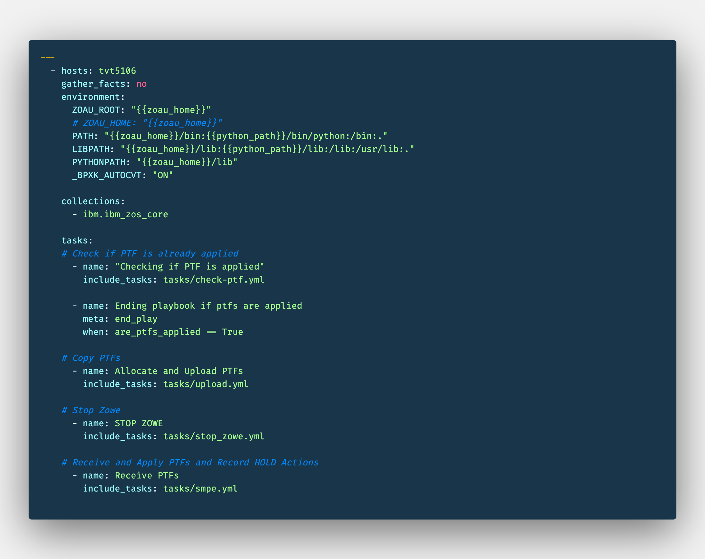

# Going a bit deeper on Ansible - Upgrade Zowe with playbooks

## Introduction

I've started to learn about Ansible, and was amazing how easy is to get started and to find information on internet on sites like stackoverflow for example. 
Ansible is really new for z/OS but is really popular on other platforms and we may use a lot of what is available together with the galaxy modules released by IBM for zOS.

## Prerequisites

- Linux environment or Docker
- Python and Z Open Automation Utilities on z/OS LPAR
- Zowe - As we are upgrading it.
- Basic understanding about what is Ansible - you can learn from my previous video on Ansible Basics: https://www.youtube.com/watch?v=99ISlCacneY

On this tutorial we are using docker to make easier for users from any platform to get started, so they don't need to worry about ansible installation. I cover the steps for ansible install on the link about Getting Started with ansible.

## Estimated time

You should be able to finish this tutorial in about xx minutes. To complete the playbook can be more depending on your connection.

## Steps

1 - Our folder structure and understanding the files we are using

2 - Using template, zos_encode and zos_job_submit, and conditional statements.

3 - Using copy and loop to upload our PTFs

4 - Using zos_operator to issue commands and stop our Zowe tasks

5 - Receiving and applying our PTFs


### 1 - Our folder structure and understanding the files we are using

We are keeping all configuration needed, our variables, tasks playbook all in our working directory. 
```
.
├── Dockerfile
├── README.md
├── ansible.cfg
├── data
├── group_vars
│   └── tvt5106.yml
├── inventory
│   └── hosts
├── tasks
│   ├── check_ptf.yml
│   ├── smpe.yml
│   ├── stop_zowe.yml
│   └── upload.yml
├── templates
│   ├── apply.j2
│   ├── list_ptfs.j2
│   └── receive.j2
└── zowe_upgrade.yml

5 directories, 13 files
```
#### ansible.cfg


Ansible starts looking for the configuration file in the current directory before going to `/etc/ansible`. Here i'm informing 2 groups of configuration, deaults and config for ssh connection. 
With `host_key_checking = False` i don't need to confirm the host fingerprint for evey ssh connection. For our example the `forks = 25` don't have too much influence, this is the number of parallel processes to spawn when communicating with our hosts. `retry_files_enabled = False` will tell ansible to do not create retry files, this is a kind of files where ansible include some logs about failed tasks.
The `inventory` is pointing to where we have our hosts definitions.
The `pipelining` reduces number of SSH operations and improve our performance.

#### inventory/hosts


Here we keep our inventory, we can create multiple groups of LPARs, for example dev, test, production... In this case i have the tvt5106 and it's address only.

Creating that allow me to create `tvt5106.yml` and link the variables for this group.

#### group_vars/tvt5106.yml


Instead of keep the variables inside of our playbook, keeping them on group_vars directory allow us to have a more clean playbook, and more organized as we can even reuse that depending on our configuration across groups on our inventory.

So we start with the connection related variables, which port to connect, with which user and password.
The next group of variables, have the system related ones, where in this lpar we have python installed, what is the home directory for ZOAU and the properties for execution.(https://ansible-collections.github.io/ibm_zos_core/playbooks.html#group-vars)

Specific for our playbook, we have here the PTFs we are installing, and we are using a list(array) with the ptfs that we are going to install. As we are installing the ptfs on our smpe, for our receive and apply we need to inform the global csi and the target zone where they are going to be installed.

The last two variables, are variables i'm using to control my playbook, so in case they have been installed i don't proceed with the tasks and if the receive fail i also stop the playbook.

This completes our configuration, now let's take a look on our playbook, tasks and templates.

#### zowe_upgrade.yml


The playbook wraps everything, the tasks, our variables. We are going to split the tasks in 4 groups.

First we are going to verify if the ptfs we want install are already on our SMPE, if so there is no reason to continue.

Then we are copying our ptfs from the data directory into our host.

We stop our Zowe STCs.

And we proceed to receive the PTFs and Apply and record the hold data.

We finish after the apply, just in case there are manual actions to be done manually.

### 2 - Using template, zos_encode and zos_job_submit, and conditional statements.


To get started, let's verify if the PTFs we wanna install are installed before we try to do anything.
For that we are using `template` module, so the same template would be available for multiple environments with different CSIs, it would just take the right variable from the right group of variables.

```
- name: Upload job to list ptfs
  template: 
    src: list_ptfs.j2
    dest: /var/zowe/ptfs/list_ptfs
    backup: no
```
For this task we are taking our `templates/list_ptfs.j2`, ansible look for the variables identified inside of `{{ variable }}` and change for it's value. The results are saved on target host at `/var/zowe/ptfs/list_ptfs`, without making a backup.


When this template was generated, it was on ASCII, so we are going to use `zos_encode` to get a EBCDIC version, the one we are submitting to get our list of ptfs.

```
- name: Change encoding to IBM-1047
  zos_encode:
    src: /var/zowe/ptfs/list_ptfs
    dest: /var/zowe/ptfs/list_ptfs.jcl
    from_encoding: ISO8859-1
    to_encoding: IBM-1047
    backup: no
```

With our JCL ready, we are going to use the `zos_submit_job` to submit this, informing the source, letting it know that we are using a USS file instead of dataset. Before proceed we want to wait it's completion and register the value on `job_detail`, so we can work with these results.

```
- name: Running LIST PTFS for {{global_csi}}
  zos_job_submit:
    src: "/var/zowe/ptfs/list_ptfs.jcl"
    location: USS
    wait: true
    return_output: true
  register: job_detail
```
Now to verify if the ptfs are applied already, we need to get the report from our job_detail, and using `set_fact` we can take the `jobs[0]` it is in the list format, even that we just have one so we apss index 0, and the report is inside of the `ddnames[5]`, property `content`.

Content is a list, we want to have a string to look for the words, so let's also join the itens using `\n`:
```
- name: Setting fact `Job Results`
  set_fact:
    job_results: "{{ job_detail.jobs[0].ddnames[5].content | join('\n') }}"
```
If you wanna see your results on screen you can use `debug` module to display it:
```
- name: Results
  debug:
    msg: "{{ job_results }}"
```
To be able to proceed or not, we are now verify if the ptfs are present on this `job_results`
```
- name: PTFs are applied? {{ are_ptfs_applied }}
  set_fact:
    are_ptfs_applied: true
  when: "ptfs[0]  in job_results and ptfs[1]  in job_results"
```
The variable `are_ptfs_applied` were defined on our group_vars, and now `when` we found the `ptfs[0]` and `ptfs[1]` inside of `job_results` we change it's value
